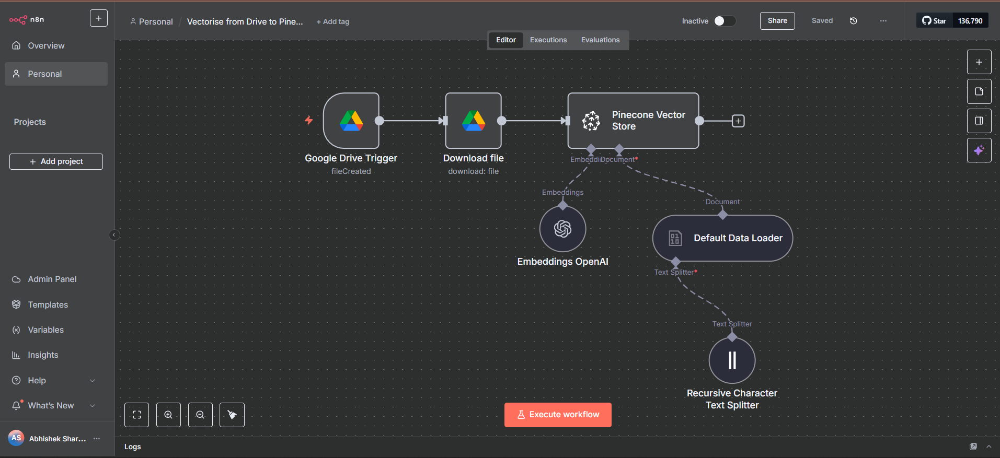
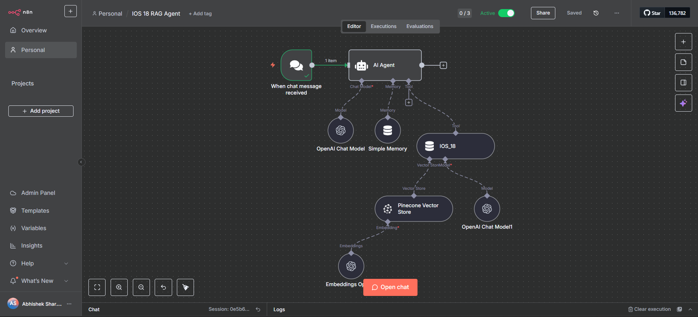

# RAG Agent with n8n + Pinecone (Document Q&A System)

## Problem

Organizations often have unstructured documents (PDFs, reports, notes) stored in Google Drive or other sources. Searching these documents is slow, and traditional keyword search fails to capture semantic meaning.
Teams need a way to query documents in natural language and get precise, context-aware answers.

## Solution (n8n)

- This workflow implements a RAG pipeline using n8n, OpenAI, and Pinecone:
- Google Drive Trigger → Watches for new documents uploaded.
- Text Loader & Splitter → Extracts and splits documents into manageable chunks.
- OpenAI Embeddings → Converts text chunks into vector embeddings.
- Pinecone Vector Store → Stores embeddings for semantic search.
- AI Agent → When a user sends a query, retrieves relevant context from Pinecone and generates a natural language answer.

## Features

- Automatic ingestion: New files from Google Drive are vectorized automatically.
- Semantic search: Retrieves the most relevant chunks, not just keyword matches.
- AI Q&A: OpenAI generates contextual responses grounded in your document data.
- Memory-aware: Includes a simple memory store for conversational continuity.

## Stack

* n8n – automation platform
* Google Drive – document source
* OpenAI API – embeddings + LLM responses
* Pinecone – vector database for retrieval

## How to Run (Demo)
1. Import `workflow.json` into n8n (this export is sanitized; set your own credentials).
2. Create the required credentials in n8n (WhatsApp/Telegram/OpenAI/etc.).
3. Create a Google Sheet / Notion DB / Airtable base as needed.
4. Update node IDs/URLs in the workflow to match your resources.
5. Trigger the entry node (Cron/Webhook/Gmail) with sample data from `/sample-data`.

## Repo Structure
```
/
├─ README.md
├─ workflow.json            # sanitized; no secrets
├─ /screenshots             # add 2–4 PNGs (flow overview & success logs)
├─ /sample-data             # example payloads (JSON/CSV)
└─ LICENSE                  # MIT license
```

## Screenshots



## Notes on Credentials & Safety
- This repo does **not** include secrets. Configure credentials inside n8n.
- Replace any test tokens/IDs with your own before running.
